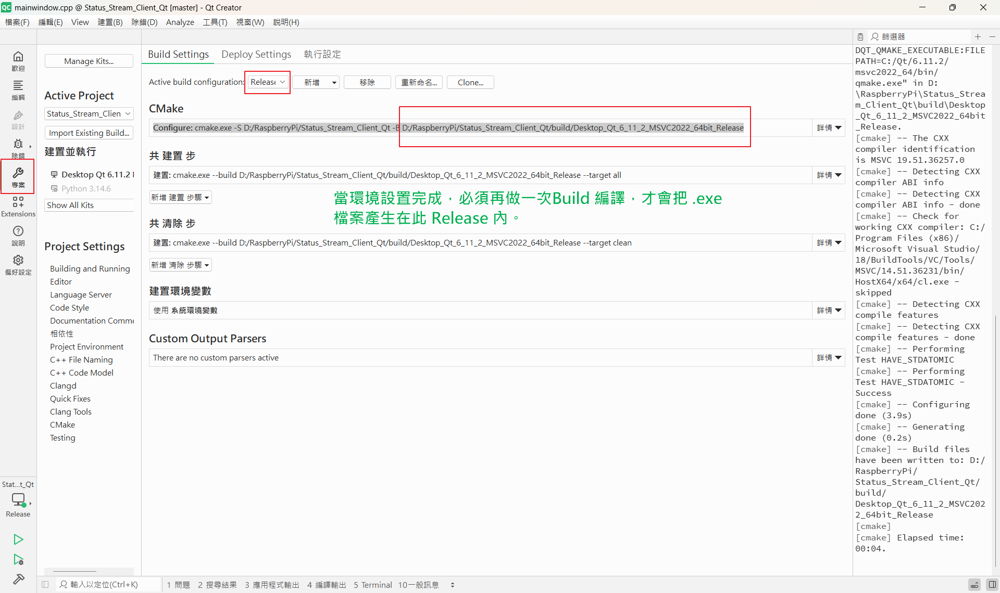
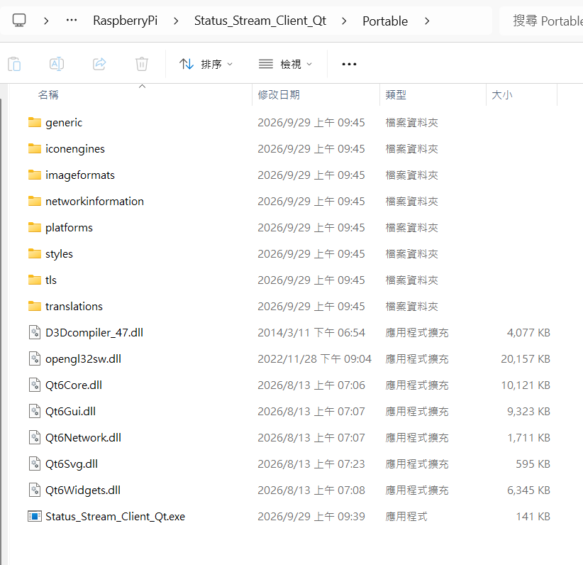
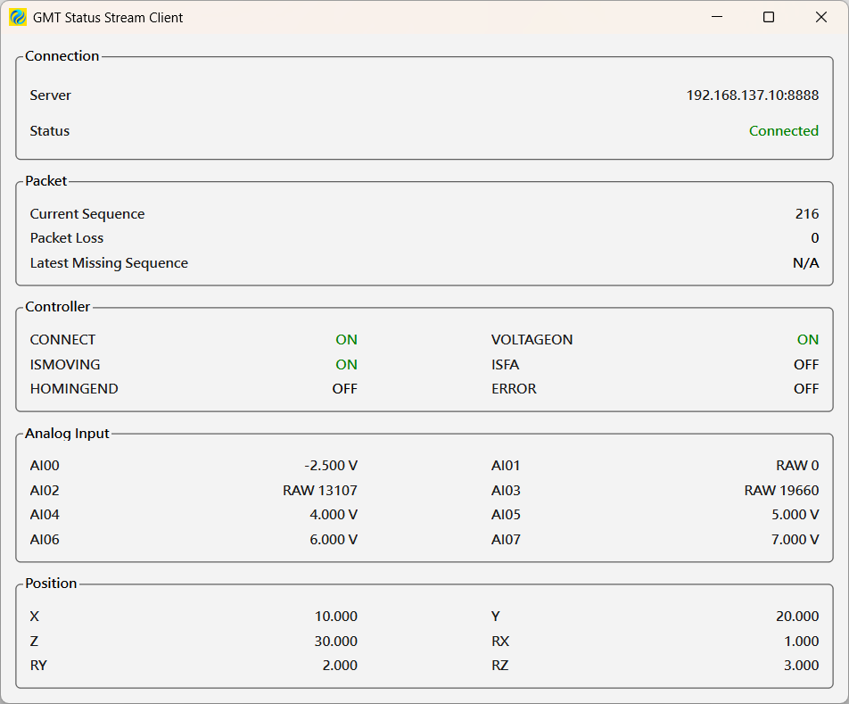

# GMT Status Stream Client Qt

## 1. 專案簡介

`Status_Stream_Client_Qt` 是 GMT Status Stream 的 Windows Qt GUI Client。

本專案負責透過 TCP 連線至 STM32H755 CM4 的 Status Stream Server，接收週期性 Status Packet，完成封包驗證、Payload Decode、Status Data Parsing，並將 Controller、Analog Input、Position 等即時狀態顯示於 Qt GUI。

本專案為獨立 Qt Client，不修改既有的 CLI Golden/Reference Client。

---

## 2. 專案環境

* OS：Windows 11 25H2
* Qt：Qt 6.11.2
* Qt Creator：20.0.1
* Compiler：MSVC 2022 64-bit
* Build System：CMake
* Build Tool：Ninja
* Language：C++17
* GUI Framework：Qt Widgets

---

## 3. 網路架構

目前測試架構：

```text
Windows PC
Qt Status Stream Client
192.168.137.x
        |
        |
       HUB
      /   \
     /     \
Raspberry Pi CM5     STM32H755 CM4
                     192.168.137.10
                           |
                           |
                    Status TCP Server
                       TCP Port 8888
```

Qt Client 目前連線至：

```text
Server IP : 192.168.137.10
Server Port : 8888
```

---

## 4. Status Stream Protocol

### TCP Server

* STM32H755 CM4
* TCP Server
* Port：`8888`
* Server IP：`192.168.137.10`

### Packet Format

完整 Status Packet：

```text
Total Packet = 151 bytes
```

結構：

```text
Header       10 bytes
Payload     139 bytes
CRC           2 bytes
--------------------
Total       151 bytes
```

### Header

```text
Byte 0       Magic = 'G' = 0x47
Byte 1       Magic = 'S' = 0x53
Byte 2       Version = 1
Byte 3       Type = Status = 0x01
Byte 4-7     Sequence (uint32, Little Endian)
Byte 8-9     Payload Length = 139 (uint16, Little Endian)
```

### Payload

Payload 長度：

```text
139 bytes
```

格式：

```text
> + 136 ASCII HEX characters + \r\n
```

其中：

```text
136 ASCII HEX characters
        ↓
68 bytes raw status data
```

### CRC

CRC16：

```text
Initial value = 0xFFFF
Polynomial    = 0xA001
```

CRC 計算範圍：

```text
Header + Payload
```

CRC 傳送順序為 Little Endian。

---

## 5. Raw Status Data

Decode 後的 Raw Status Data：

```text
68 bytes
```

格式：

```text
Bytes  0-3     Controller Status
Bytes  4-19    AI00 ~ AI07
Bytes 20-67    X, Y, Z, RX, RY, RZ
```

Position 資料使用 IEEE-754 `double`，Raw Data 中採 Big Endian / MSB first。

---

## 6. Controller Status

Controller Status 為 UINT32。

目前使用的 Bit 定義：

```text
Bit 0    CONNECT
Bit 1    VOLTAGEON
Bit 3    ISMOVING
Bit 4    ISFA
Bit 5    HOMINGEND
Bit 6    ERROR
```

Qt GUI 會將這些狀態顯示為：

```text
ON / OFF
```

---

## 7. Analog Input

AI 共 8 個 Channel：

```text
AI00
AI01
AI02
AI03
AI04
AI05
AI06
AI07
```

目前 Scaling：

```text
AI00    Load Cell       -10 ~ +10 V
AI01    Reserved
AI02    I2C0
AI03    I2C3
AI04    PM Ch0           0 ~ 10 V
AI05    PM Ch1           0 ~ 10 V
AI06    PM Ch2           0 ~ 10 V
AI07    PM Ch3           0 ~ 10 V
```

Qt GUI 目前：

* AI00 顯示 Voltage
* AI01 ~ AI03 顯示 RAW
* AI04 ~ AI07 顯示 Voltage

Scaling 計算沿用已驗證的 CLI Golden Client。

---

## 8. Qt GUI 功能

目前 GUI 已完成以下主要區域：

```text
Connection
Packet
Controller
Analog Input
Position
```

### Connection

顯示：

```text
Server
Status
```

目前狀態包括：

```text
Connecting...
Connected
Connection Failed
Connection Lost
```

### Packet

顯示：

```text
Sequence
Packet Loss
Latest Missing
```

### Controller

顯示：

```text
CONNECT
VOLTAGEON
ISMOVING
ISFA
HOMINGEND
ERROR
```

### Analog Input

顯示：

```text
AI00 ~ AI07
```

### Position

顯示：

```text
X
Y
Z
RX
RY
RZ
```

---

## 9. Qt Thread Architecture

由於 TCP Client 的 `Receive()` 為 blocking operation，因此 TCP 接收工作放在獨立的 `QThread` 中。

目前架構：

```text
MainWindow
    |
    +--- QThread
           |
           +--- TcpWorker
                  |
                  +--- TcpClient
```

資料透過 Qt Signal / Slot 傳回 GUI：

```text
TcpWorker
    |
    +--- statusReceived()
    |
    +--- packetStatsUpdated()
    |
    +--- connectionStatusChanged()
    |
    v
MainWindow
```

因此 TCP 接收不會直接阻塞 GUI Thread。

---

## 10. 目前已完成並驗證的功能

目前 Qt Client 已完成並測試：

* TCP Connect
* TCP Receive
* TCP Packet Assembly
* Status Packet Validation
* Version / Type / Length Validation
* CRC16 Validation
* Status Payload Validation
* HEX Decode
* 68-byte Raw Status Decode
* Controller Status Parsing
* AI Parsing
* AI Scaling
* Position Parsing
* Sequence Tracking
* Packet Loss Tracking
* Latest Missing Sequence
* GUI Status Update
* Connection Status Update
* Worker Thread
* Qt Signal / Slot
* Normal Application Shutdown
* Server / Network Abnormal Disconnect Detection
* `Connection Lost` 顯示

---

## 11. 斷線測試結果

已實際測試 Windows PC 網路線斷線。

測試方式：

```text
Qt Client
    |
    +--- HUB
          |
          +--- STM32H755
```

在 Qt Client 已經 Connected 並持續接收資料時：

```text
拔除 Windows PC → HUB 的網路線
```

Qt 正確偵測到 Socket Receive Error。

實際測試結果：

```text
[TcpWorker] Sequence: 10
[TcpWorker] Status payload decoded: 68 bytes
[TcpWorker] StatusData parsed successfully
[TcpWorker] Receive stopped: -1
[TcpWorker] Receive loop ended
[MainWindow] Connection status: "Connection Lost"
```

此結果確認：

```text
Connected
    ↓
Network disconnected
    ↓
Receive() returns -1
    ↓
Connection Lost
    ↓
Receive loop ended
```

目前尚未加入斷線後自動重新連線功能。

---

## 12. Status Stream 更新週期

### 正式規格

Status Stream Server 原始規格為：

```text
200 ms / packet
```

也就是：

```text
5 packets / second
```

### 目前測試設定

為了目前開發與測試階段的觀察，目前 STM32H755 Status Stream Server 暫時採用：

```text
1000 ms / packet
```

也就是：

```text
1 packet / second
```

這只是目前測試設定，**不是正式 Status Stream 規格**。

---

## 13. 如何修改 Status Stream 更新週期

更新週期由 STM32H755 Status TCP Server 控制。

主要設定位置：

```text
STM32H755 CM4
CM4/Core/Src/status_tcp_server.c
```

目前使用的設定：

```cpp
#define STATUS_TCP_PERIOD_MS 1000U
```

如果要恢復正式規格：

```cpp
#define STATUS_TCP_PERIOD_MS 200U
```

也就是：

```text
1000U
  ↓
200U
```

修改後重新 Build / Flash STM32H755。

### 注意

Qt Client 本身不需要修改這個週期。

Qt Client 是接收端，會依照 STM32H755 Status Stream Server 實際送出的封包頻率接收資料。

---

## 14. Golden / Reference CLI

本 Qt 專案與既有 CLI Client 分開。

既有 CLI Golden/Reference 專案：

```text
D:\RaspberryPi\Status_Stream_Client
```

Qt 專案：

```text
D:\RaspberryPi\Status_Stream_Client_Qt
```

目前 Qt 開發期間：

**不得修改 CLI Golden/Reference 專案。**

Qt Client 的封包處理與 Status Data Parsing 以已驗證的 CLI 實作作為參考。

---

## 15. 後續開發計畫

目前 Qt 功能層已完成第一階段驗證。

後續計畫：

### Checkpoint 1 — Current

建立 GitHub checkpoint：

```text
Qt Client
功能完成
斷線偵測完成
尚未加入 Auto-Reconnect
尚未進行 UI 美化
```

### Checkpoint 2 — Auto-Reconnect

加入：

```text
Connection Lost
      ↓
自動重新連線
      ↓
Connecting...
      ↓
Connected
      ↓
恢復 Status Stream
```

完成後建立 GitHub checkpoint。

### Checkpoint 3 — UI Polish

進行：

* Layout refinement
* Spacing
* Alignment
* Font
* Status visual indication
* Window size
* GUI readability
* Overall appearance

完成後建立 GitHub checkpoint。

完成後：

```text
Qt Status Stream Client
```

正式結案。

---

## 16. CLI 後續工作

Qt Client 結案後，回到：

```text
D:\RaspberryPi\Status_Stream_Client
```

進行 CLI Status Stream 功能補強。

工作內容：

1. 補齊目前盤點出的 CLI 功能不足
2. 驗證 CLI
3. 加入斷線後自動重新連線
4. 完成測試
5. 建立 GitHub checkpoint

完成後：

```text
Qt Client
    +
CLI Client
    +
STM32H755 Status Stream Server
```

整個 Status Stream 專案正式結案。

---

## 17. 開發原則

本專案遵循以下原則：

* Qt Client 與 CLI Client 分離
* 不修改已驗證的 Golden/Reference 架構
* 一次只修改一個小功能
* 每個功能修改後立即 Build / Run / Test
* 保留 GitHub checkpoint
* 先完成核心功能，再進行 UI 美化
* 不在未驗證的情況下重新設計已驗證的 TCP / Packet Architecture
* Status Stream Server 的正式週期以 200 ms 為準
* 目前測試週期暫時使用 1000 ms

---

## 18. Current Status

目前版本：

```text
Qt Status Stream Client
Core Functionality: COMPLETE
Disconnect Detection: VERIFIED
Auto-Reconnect: NOT YET IMPLEMENTED
UI Polish: NOT YET STARTED
```

目前測試週期：

```text
1000 ms
```

正式規格：

```text
200 ms
```

正式規格修改位置：

```text
STM32H755
CM4/Core/Src/status_tcp_server.c

#define STATUS_TCP_PERIOD_MS 200U
```
# [2026-09-29] Portable 可攜式版本 (免安裝版本) 製作

## 第一步 先在 Qt Creator 左側 專案 按下，然後出現 一些路徑，在最上方的 Active build configuration 從 Debug 改成 Release
圖示 ：  



---




# Portable 版本製作與驗證流程

本專案提供 Portable 版本，目的為讓同事或客戶可以在未安裝 Qt、Qt Creator、CMake 或 Visual Studio 開發環境的 Windows 電腦上，直接執行 Status Stream Client。

Portable 版本不需要安裝程式，使用時直接複製整個 Portable 資料夾即可。

---

## 1. 開發環境

Portable 版本使用以下環境建立：

* Windows 11 25H2
* Qt 6.11.2
* MSVC 2022 64-bit
* CMake
* Ninja
* Qt Creator 20.0.1

Qt 安裝位置：

```text
C:\Qt\6.11.2\msvc2022_64
```

其中：

```text
C:\Qt\6.11.2\msvc2022_64\bin\windeployqt.exe
```

為 Qt 官方提供的 Windows 部署工具。

---

## 2. Golden / Reference CLI 保持獨立

本 Qt 專案與原本的 Golden / Reference CLI 專案完全分開。

Golden / Reference CLI：

```text
D:\RaspberryPi\Status_Stream_Client
```

Qt 專案：

```text
D:\RaspberryPi\Status_Stream_Client_Qt
```

Portable 製作過程**不修改 Golden / Reference CLI 專案**。

---

## 3. 先建立 Release Build

Portable 版本必須使用 Release 版本的 EXE。

Qt Creator 中選擇：

```text
Desktop Qt 6.11.2 MSVC2022 64bit
```

並切換至：

```text
Release
```

然後執行：

```text
Build
```

確認 Release Build 成功。

Release Build 目錄：

```text
D:\RaspberryPi\Status_Stream_Client_Qt\build\Desktop_Qt_6_11_2_MSVC2022_64bit_Release
```

確認其中已產生：

```text
Status_Stream_Client_Qt.exe
```

---

## 4. 建立 Portable 資料夾

在 Qt 專案根目錄建立：

```text
D:\RaspberryPi\Status_Stream_Client_Qt\Portable
```

將 Release Build 產生的：

```text
Status_Stream_Client_Qt.exe
```

複製到：

```text
D:\RaspberryPi\Status_Stream_Client_Qt\Portable\Status_Stream_Client_Qt.exe
```

注意：

這是複製，不是移動。

原本 Release Build 目錄內的 EXE 保留不變。

---

## 5. 使用 windeployqt 部署 Qt Runtime

開啟 PowerShell。

執行：

```powershell
& "C:\Qt\6.11.2\msvc2022_64\bin\windeployqt.exe" --release "D:\RaspberryPi\Status_Stream_Client_Qt\Portable\Status_Stream_Client_Qt.exe"
```

`windeployqt` 會分析 EXE 所需要的 Qt Runtime，並將必要的 DLL 與 Qt Plugins 複製到 Portable 資料夾。

因此不需要手動猜測需要哪些 Qt DLL。

---

## 6. Portable 目錄

執行 `windeployqt` 後，Portable 目錄會包含 EXE、Qt Runtime DLL 以及必要的 Plugins。

例如：

```text
Portable\
├─ Status_Stream_Client_Qt.exe
├─ Qt6Core.dll
├─ Qt6Gui.dll
├─ Qt6Widgets.dll
├─ platforms\
│  └─ qwindows.dll
└─ ...其他 windeployqt 自動部署的檔案
```

實際檔案數量與內容以 `windeployqt` 執行結果為準。

**不要自行猜測或刪除 DLL。**

---

## 7. 確認主要 Qt Runtime

可以使用 PowerShell 確認主要檔案存在：

```powershell
$portable = "D:\RaspberryPi\Status_Stream_Client_Qt\Portable"

"=== Portable EXE ==="
Test-Path "$portable\Status_Stream_Client_Qt.exe"

"=== Qt6Core ==="
Test-Path "$portable\Qt6Core.dll"

"=== Qt6Gui ==="
Test-Path "$portable\Qt6Gui.dll"

"=== Qt6Widgets ==="
Test-Path "$portable\Qt6Widgets.dll"

"=== Windows Platform Plugin ==="
Test-Path "$portable\platforms\qwindows.dll"
```

預期結果：

```text
True
True
True
True
True
```

---

## 8. 確認 Portable 不依賴 C:\Qt 內的檔案

可以檢查 Portable 資料夾：

```powershell
Get-ChildItem "D:\RaspberryPi\Status_Stream_Client_Qt\Portable" -Recurse -File |
    Where-Object { $_.FullName -like "C:\Qt*" }
```

預期不應該有輸出。

Portable 執行時應該使用自己資料夾內部署的 Qt Runtime，而不是依賴開發電腦上的 Qt 安裝目錄。

---

## 9. 開發電腦上的 Portable 測試

直接執行：

```powershell
& "D:\RaspberryPi\Status_Stream_Client_Qt\Portable\Status_Stream_Client_Qt.exe"
```

確認：

* 程式可以啟動
* GMT Status Stream Client 視窗正常
* Logo 正常
* Connection 顯示正常
* Packet 顯示正常
* Controller 顯示正常
* Analog Input 顯示正常
* Position 顯示正常
* Status Stream 資料正常更新
* TCP Disconnect / Reconnect 行為正常

---

## 10. 最終乾淨電腦驗證

開發電腦測試成功後，將**整個 Portable 資料夾**複製到另一台 Windows 電腦。

測試電腦不需要安裝：

* Qt
* Qt Creator
* CMake
* Visual Studio 開發環境
* Qt 開發套件

也不需要設定 Qt PATH。

直接執行：

```text
Portable\Status_Stream_Client_Qt.exe
```

確認程式可以正常啟動並執行完整功能。

---

## 11. Portable Release 判定

只有在乾淨 Windows 電腦完成實際測試並 PASS 後，才將此 Portable 資料夾正式視為 Release Package。

Release Package 的基本條件：

```text
Portable\
└─ Status_Stream_Client_Qt.exe
   + windeployqt 所部署的 Qt DLL / Plugins
```

不需要另外安裝 Qt。

不需要另外安裝 Qt Creator。

不需要另外安裝 CMake。

不需要另外安裝 Visual Studio 開發環境。

不需要額外加入 Qt DLL。

---

## 12. 發行時的原則

Portable 發行時應該：

1. 保留整個 Portable 資料夾。
2. 不要只複製 EXE。
3. 不要自行刪除 `windeployqt` 部署的 DLL 或 Plugins。
4. 不要依賴開發電腦的 `C:\Qt\...`。
5. 不修改 Golden / Reference CLI。
6. 發行前應在乾淨 Windows 電腦實際測試一次。

最終可以將整個：

```text
Portable
```

資料夾壓縮成 ZIP 提供給同事或客戶。

例如：

```text
Status_Stream_Client_Qt_Portable.zip
```

使用者解壓縮後，直接執行：

```text
Status_Stream_Client_Qt.exe
```

即可。

---

## 13. Portable 與開發版本的關係

Portable EXE 是從 Release Build 複製出來的獨立發行副本。

原始 Release Build：

```text
D:\RaspberryPi\Status_Stream_Client_Qt\build\Desktop_Qt_6_11_2_MSVC2022_64bit_Release
```

Portable Release：

```text
D:\RaspberryPi\Status_Stream_Client_Qt\Portable
```

兩者應該分開保存。

Portable 資料夾是給同事 / 客戶使用的發行版本，不應直接拿來進行日常開發。

---

## 14. 總結

本專案 Portable 版本的製作流程為：

```text
Qt 專案
   │
   ├─ Release Build
   │
   ▼
Release EXE
   │
   ├─ Copy
   ▼
Portable\Status_Stream_Client_Qt.exe
   │
   ├─ windeployqt --release
   ▼
Portable + Qt Runtime + Plugins
   │
   ├─ 開發電腦測試
   │
   ▼
   ├─ 乾淨 Windows 電腦測試
   │
   ▼
PASS
   │
   ▼
Portable Release Package
   │
   └─ ZIP 發行
```

Portable 版本的核心概念是：

> **程式與所需 Qt Runtime 一起攜帶，不要求使用者另外安裝 Qt 開發環境。**


